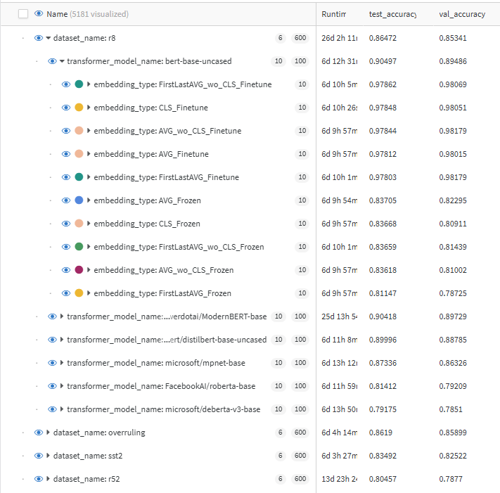

# Classificação de texto com variações do BERT

Este repositório é baseado no artigo:

**CLS, Averaging, or Layer Combinations? Embedding Strategies for Text Classification Across BERT Variants**

*Eliton Perin, Mariana Caravanti, Anderson Bessa e Edson Matsubara*

> **Referência:** Este repositório contém os experimentos descritos no artigo, que investiga estratégias de extração de embeddings de variantes do BERT para tarefas de classificação de texto, avaliando CLS token, média das camadas finais e combinações da primeira e última camada.

## 💡 Sobre o estudo

A literatura oferece recomendações inconsistentes sobre a melhor forma de extrair embeddings de variantes do BERT ao projetar classificadores de texto. Algumas abordagens recomendam o uso do token CLS, outras sugerem a média entre as primeiras e últimas camadas, ou apenas a última camada. Para resolver essas contradições, realizamos uma avaliação experimental em benchmarks de classificação de texto — incluindo R8, SST2, Movie Review, TREC6 Overruling, R52, TREC6, Snippets e Ohsumed — utilizando variantes populares do BERT, como RoBERTa, DistilBERT, DeBERTa-v3, MPNet, ModernBERT e o BERT original.

Foram testadas todas as combinações entre datasets, modelos e estratégias de embeddings: CLS, média da última camada e média entre a primeira e última camada. Os resultados foram analisados estatisticamente usando ANOVA e teste t pareado. O estudo fornece evidências práticas sobre as melhores escolhas de extração de embeddings para melhorar o desempenho em tarefas de classificação textual, oferecendo orientações úteis para pesquisadores e profissionais da área.

## 📦 Requisitos

* Python 3.9 ou superior (recomendado: 3.10)
* pip atualizado
* CUDA 11.8 instalado (para uso com GPU)

## 🛠️ Instalação

### 1. Clone o repositório (caso aplicável)

```bash
git clone git@github.com:liafacom/text_classification_bert_variants.git
cd text_classification_bert_variants
```

### 2. Crie um ambiente virtual (opcional, mas recomendado)

```bash
python -m venv .venv
source .venv/bin/activate  # Linux/Mac
# ou
.venv\Scripts\activate      # Windows
```

### 3. Instale o PyTorch com suporte a CUDA 11.8

```bash
pip install torch==2.1.0+cu118 torchvision==0.16.0+cu118 torchaudio==2.1.0 --index-url https://download.pytorch.org/whl/cu118
```

### 4. Instale as demais dependências

```bash
pip install -r requirements.txt
```

### 5. Instale a biblioteca com os datasets utilizados diretamente do GitHub

```bash
pip install git+https://github.com/liafacom/text_dataset.git
```

## 📁 Arquivo `requirements.txt`

O projeto inclui um arquivo `requirements.txt` com as seguintes dependências:

```text
wandb==0.17.4
seaborn==0.13.2
scikit-learn==1.5.1
numpy==1.26.4
pandas==2.2.2
matplotlib==3.9.1
transformers==4.51.2
tqdm==4.66.4
```


## 📅 Execução dos Experimentos

O script `run.sh` automatiza a execução dos experimentos para diferentes configurações de semente aleatória, dataset, número de épocas e tamanho de batch. Ele utiliza o script principal `benchmark_transformers_classic.py` para realizar os testes.

### Exemplo de configuração atual

```bash
SEEDS=(0)
DATASETS=("MR")
EPOCHS=(10)
BATCH_SIZES=(16)
ID_CUDA=0
TAGS="test machine1"
```

### Como rodar

Certifique-se de que o script `run.sh` está com permissão de execução:

```bash
chmod +x run.sh
./run.sh
```

### Resultado esperado

O script irá iterar sobre todas as combinações dos valores definidos e executar chamadas como:

```bash
python3 benchmark_transformers_classic.py --seed 0 --dataset MR --epochs 10 --batch_size 16 --cuda 0 --tags "test machine1"
```


Link para as rodadas dos experimentos no Wandb: 
[Experimentos](https://wandb.ai/elitonperin/transf-benchmark-clf-classic/)

Obs.: Filtre pela tag: paper2. 
As demais tags foram usadas para teste.
Para uma visualização melhor, agrupe por: dataset_name, transformer_model_name, embedding_type.
Selecione as colunas de interesse, por exemplo: test_accuracy.



### Análises em Gráficos e Figuras

Um Colab foi produzido para comparar resultados em gráficos, figuras e tabelas e estão disponíveis [aqui: figure_graph_diagrams.ipynb](https://colab.research.google.com/drive/13xw6s1rPGGcRL_bgHdJOVM5JFKasD3gW?usp=sharing).
